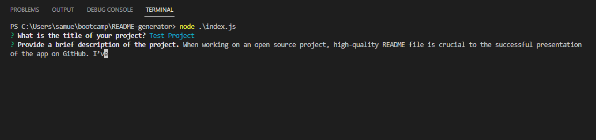
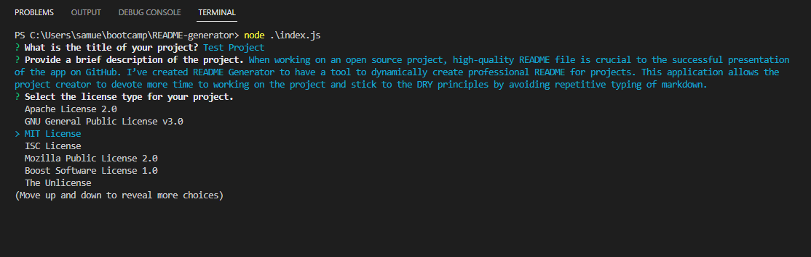
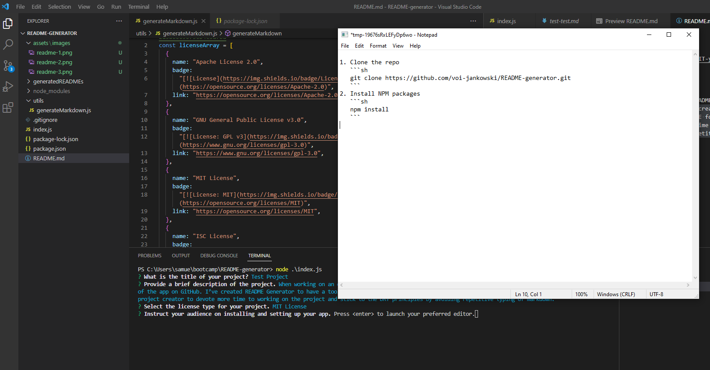
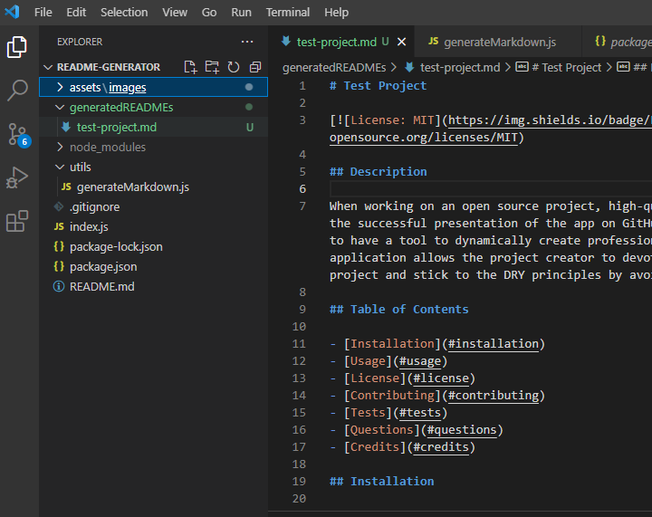

# README Generator

[](https://opensource.org/licenses/MIT)

## Description

When working on an open source project, high-quality README file is crucial to the successful presentation of the app on GitHub. I’ve created README Generator to have a tool to dynamically create professional README for projects. This application allows the project creator to devote more time to working on the project and stick to the DRY principles by avoiding repetitive typing of markdown.

## Table of Contents

- [Installation](#installation)
- [Usage](#usage)
- [License](#license)
- [Contributing](#contributing)
- [Tests](#tests)
- [Questions](#questions)
- [Credits](#credits)

## Installation

1. Clone the repo

   ```sh
   git clone https://github.com/voi-jankowski/README-generator.git
   ```

2. Install NPM packages

   ```sh
   npm install
   ```

<p align="right">(<a href="#readme-top">back to top</a>)</p>

## Usage

Start with the below command in your terminal:

```sh
node index.js
```

You will be presented with a series of questions about your project. Type the answer to each one and press Enter to proceed to the next question.



When you are asked about the licence type for your project, use up and down arrows to highlight your selection and press Enter.



Some of the prompts could require more complex and multi line answers. In those instances your preffered text editor will be launched where you can create and edit your answer. Once you exit the editor, the contents of the temporary file are read in as the result.



After the last question you will be presented with the list of your answers in your terminal and your README file will be created in `generatedREADMEs` folder. Copy and paste its content to your project’s README file.



<p align="right">(<a href="#readme-top">back to top</a>)</p>

## License

Distributed under the [MIT License](https://opensource.org/licenses/MIT). See LICENSE.txt for more information.

<p align="right">(<a href="#readme-top">back to top</a>)</p>

## Contributing

If you have a suggestion that would make this better, please fork the repo and create a pull request. You can also simply open an issue with the tag "enhancement".
Don't forget to give the project a star!

1. Fork the Project
2. Create your Feature Branch (`git checkout -b feature/YourFeature`)
3. Commit your Changes (`git commit -m 'Add Your Feature'`)
4. Push to the Branch (`git push origin feature/YourFeature`)
5. Open a Pull Request

<p align="right">(<a href="#readme-top">back to top</a>)</p>

## Tests

No tests provided for this app yet.

<p align="right">(<a href="#readme-top">back to top</a>)</p>

## Questions

If you have any questions about the project please contact me through [my Github](https://github.com/voi-jankowski) or email me at [voi.jankowski@gmail.com](mailto:voi.jankowski@gmail.com). The location of the project [on GitHub](https://github.com/voi-jankowski/README-generator).

<p align="right">(<a href="#readme-top">back to top</a>)</p>

## Credits

The project was created with the help of:

- [othneildrew](https://github.com/othneildrew/Best-README-Template/blob/master/README.md) - the guidlines for perfect README.
- [lukas-h](https://gist.github.com/lukas-h/2a5d00690736b4c3a7ba) and his list of Markdown License badges.

<p align="right">(<a href="#readme-top">back to top</a>)</p>
